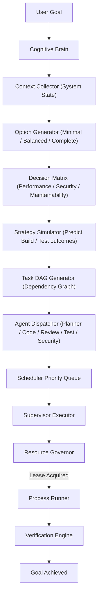
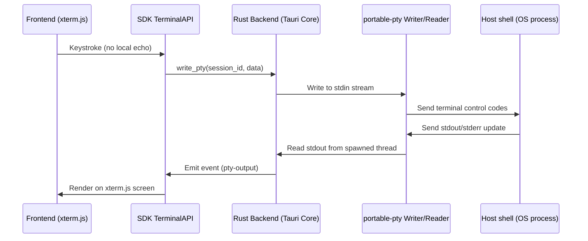
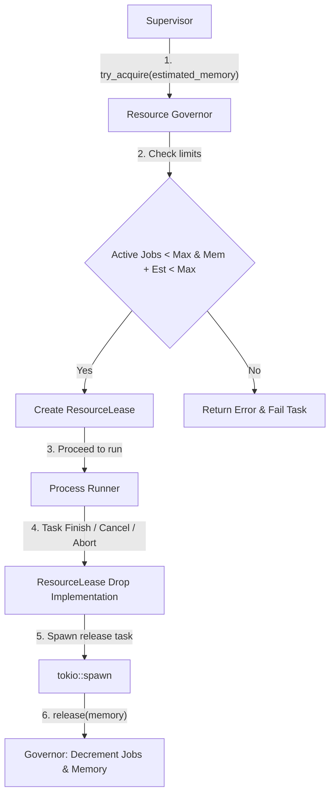

# LocalFlow IDE

**Runtime-first operating layer for AI-native development systems.**

Not an AI editor. Not a VSCode clone. A programmable local-first runtime platform where developers build their own development environments.

## Architecture

```
┌─────────────────────────────────────────────────────┐
│                    SDK Layer                         │
│  EditorAPI  RuntimeAPI  TerminalAPI  PluginAPI       │
├─────────────────────────────────────────────────────┤
│                 Frontend Surfaces                    │
│  Editor  Terminal  Workspace  Dashboard  Cognitive   │
├─────────────────────────────────────────────────────┤
│                  IPC Contracts                       │
│         Zod Schemas  ·  Serde  ·  Capabilities       │
├─────────────────────────────────────────────────────┤
│                 Runtime Core                         │
│  Brain  Supervisor  Scheduler  Engine  Governor      │
│  Sandbox  ModelRouter  PTY  EventBus  Inspector     │
├─────────────────────────────────────────────────────┤
│                    Backend                           │
│     Rust (Tauri)  ·  Tokio  ·  portable-pty         │
└─────────────────────────────────────────────────────┘
```

### Architectural Diagrams

#### 1. Cognitive Planning Scheduler and Task DAG Execution Flow



#### 2. Interactive PTY Terminal Message Pipeline



#### 3. Resource Governance Lease Flow




## Core Systems

### Cognitive Brain
Brain thinks. Agents execute. Runtime verifies. Human controls.
- Context collection → Goal parsing → Question generation
- Option generation → Decision matrix → Strategy simulation
- Task DAG generation → Agent dispatch

### Runtime Layer
| System | Responsibility |
|--------|---------------|
| **Supervisor** | Task lifecycle, concurrency, retries, cancellation |
| **Scheduler** | Priority queue, FIFO, TaskDefinition contracts |
| **Execution Engine** | Process spawning (tokio::process::Command) |
| **PTY Manager** | Interactive shell sessions via portable-pty |
| **Resource Governor** | Memory/CPU/parallel job limits |
| **Sandbox** | Allow/deny lists, capability model, path validation |
| **Model Router** | Provider abstraction (OpenAI, Anthropic, Ollama) |
| **Event Bus** | Typed RuntimeEvent enum, mpsc channels |
| **Runtime Inspector** | Snapshot-based health monitoring |

### Agent System
- PlannerAgent, CodeAgent, ReviewAgent, TestAgent, SecurityAgent
- Task DAG dispatch from Brain
- Capability-gated execution

### Provider Layer
- OpenAI, Anthropic, Ollama, Custom HTTP
- Fallback routing, health monitoring, token budgeting

## Execution Flow

```
Goal → Brain → Questions → Options → Matrix → DAG → Agents → Verification
```

1. User submits goal
2. Brain analyzes context, generates questions to reduce ambiguity
3. Option Generator produces 3 strategies (Minimal / Balanced / Complete)
4. Decision Matrix scores each on performance, security, maintainability, testability
5. Strategy Simulator predicts build failures, test coverage
6. Task DAG Generator creates dependency graph
7. Agent Dispatcher routes DAG nodes to specialized agents
8. Supervisor executes with concurrency limits, retries, timeouts

## Getting Started

```bash
# Prerequisites: Rust, Node.js 18+, pnpm
pnpm install
pnpm build

# Development
cd apps/desktop
pnpm dev
```

## SDK

```typescript
import { RuntimeAPI, TerminalAPI, EditorAPI } from '@local-flow/sdk';

const runtime = new RuntimeAPI(window.__TAURI_INVOKE__);
const health = await runtime.health();

const terminal = new TerminalAPI(window.__TAURI_INVOKE__);
const sessionId = await terminal.create();
await terminal.write(sessionId, 'ls -la\r');
```

## Project Structure

```
apps/desktop/        — Tauri application shell
packages/
  sdk/               — Public API (RuntimeAPI, TerminalAPI, EditorAPI, PluginAPI)
  state/             — Zustand stores (runtimeStore, agentStore, resourceStore, terminalStore)
  shared-types/      — TypeScript type definitions
  runtime-contracts/ — Zod validation schemas
  logging/           — Structured logging
  ui/               — Shared React components
src-tauri/src/
  brain/             — Cognitive Brain (context, goal, questions, options, matrix, simulator, dag, dispatch)
  supervisor/        — Task lifecycle management
  scheduler/         — Priority queue, task definitions
  engine/            — Process execution
  pty/               — Terminal sessions (portable-pty)
  governor/          — Resource limits enforcement
  sandbox/           — Capability model, command validation
  model/             — Model router, provider abstraction
  agent/             — Agent system (planner, code, review, test, security)
  events/            — RuntimeEvent enum (typed event bus)
  telemetry/         — Tracing, metrics, logging
  verification/      — Verification engine
  memory/            — Memory store
  plugin/            — Plugin host
  inspector/         — Runtime snapshot inspector
```

## Tradeoffs

| Decision | Rationale |
|----------|-----------|
| Rust backend over Node.js | Process isolation, tokio async, portable-pty access |
| Tauri over Electron | Smaller binary (5MB vs 150MB), native resource APIs |
| mpsc channels over message broker | Simplicity for local-first, zero network overhead |
| portable-pty over pty-rs | Cross-platform (Windows/Linux/macOS) |
| Zustand over Redux | Minimal boilerplate, no action ceremony |
| Capability model over full sandbox | Practical protection without container overhead |

## Roadmap

- [x] Core runtime (Supervisor, Scheduler, Engine, PTY)
- [x] Cognitive Brain (context, planning, DAG, dispatch)
- [x] Agent system (Planner, Code, Review, Test, Security)
- [x] Model router (OpenAI, Anthropic, Ollama)
- [x] Resource governor (memory, CPU, parallel limits)
- [x] Sandbox with capability model
- [x] SDK (RuntimeAPI, TerminalAPI, EditorAPI, PluginAPI)
- [x] Event bus (typed RuntimeEvent)
- [ ] Ollama local execution integration
- [ ] Plugin system (activate/deactivate/permissions)
- [ ] Memory layer (persistent context)
- [ ] Verification layer (build verification, test verification)
- [ ] Resource dashboard (frontend)
- [ ] Cognitive panel (frontend)
- [ ] Agent visualization timeline
- [ ] Multi-agent parallel execution
- [ ] OpenTelemetry export
- [ ] Approval workflows (human-in-the-loop)

## License

MIT
