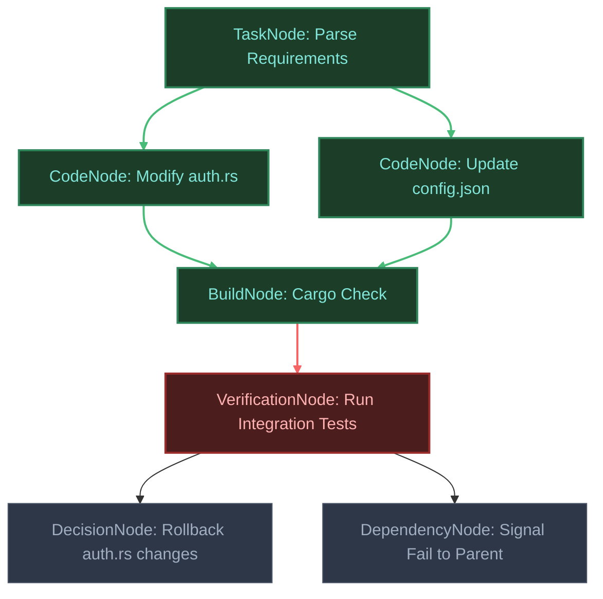
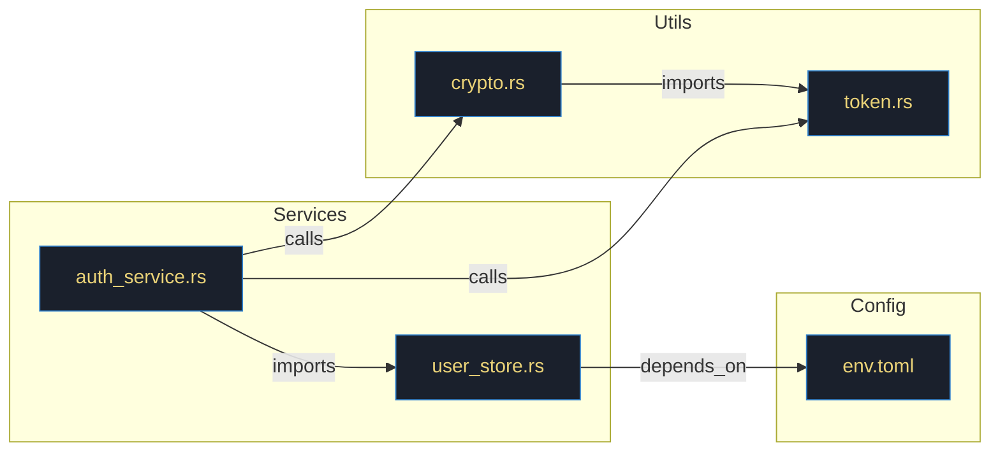
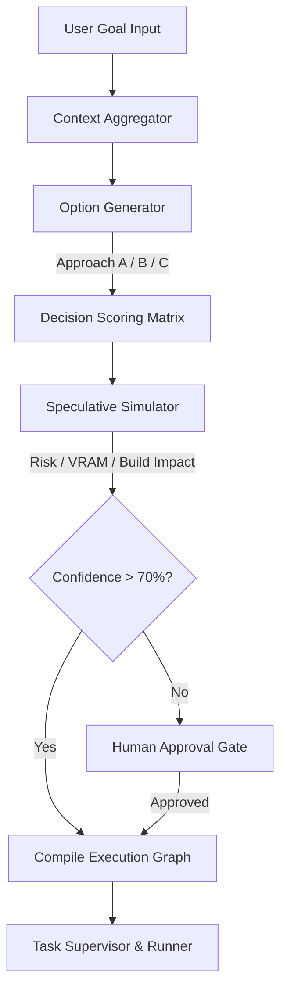
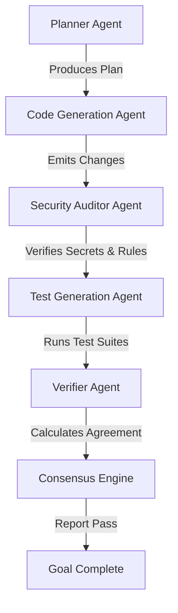
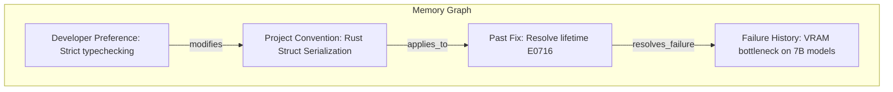
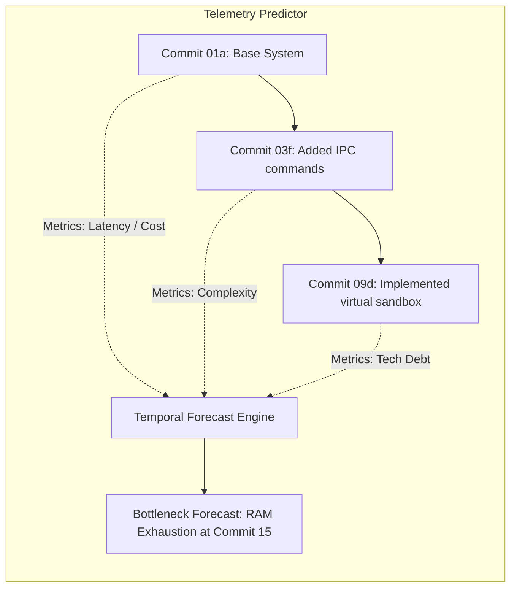

# LocalFlow IDE

**Research-grade cognitive development operating layer for autonomous engineering systems.**

LocalFlow IDE is not a text editor wrapper or a clone of existing desktop interfaces. It is a local-first, programmable, runtime-integrated cognitive operating layer designed to support multi-agent engineering workflows. By mapping codebases to dynamic knowledge graphs, scheduling tasks via Directed Acyclic Graphs (DAGs), virtualizing filesystem access, and enforcing resource governance, LocalFlow provides the substrate for high-trust autonomous code generation.

---

## Vision

In modern AI-assisted software engineering, agents operate as external actors performing black-box modifications. LocalFlow transforms this relationship by elevating the IDE into a cognitive operating layer. It exposes deep runtime inspection, static code relationships, execution safety bounds, and historical telemetry directly to local and API-based models. Developers and agentic systems programmatically orchestrate their own custom development workflows on top of this infrastructure.

---

## System Architecture

The LocalFlow runtime layer is built in Rust using Tokio for async execution, portable-pty for system terminal interaction, and Tauri for IPC command mapping. The frontend surface utilizes React and Tailwind CSS, communicating with the core via type-safe JSON-RPC protocols.

```
┌────────────────────────────────────────────────────────────────────────┐
│                              Frontend UI                               │
│  Editor Surface  ·  Workspace Tree  ·  Terminal  ·  Cognitive Panel    │
├────────────────────────────────────────────────────────────────────────┤
│                           IPC Command Bridge                           │
│        Zod Validation Schemas  ·  Serialized JSON IPC Payload          │
├────────────────────────────────────────────────────────────────────────┤
│                       Cognitive Execution Engine                       │
│  ┌───────────────────────────┐   ┌───────────────────────────┐         │
│  │ ExecutionGraphEngine      │   │ ArchitectureGraph         │         │
│  │ (Task DAG Execution)      │   │ (AST & Import Dependency) │         │
│  ├───────────────────────────┤   ├───────────────────────────┤         │
│  │ FailureAnalysisEngine     │   │ RecoveryEngine            │         │
│  │ (Crash & Risk Forecast)   │   │ (Git Snapshots & Rollback)│         │
│  ├───────────────────────────┤   ├───────────────────────────┤         │
│  │ MemoryGraph               │   │ CostEngine                │         │
│  │ (Conventions & Fixes)     │   │ (Token / Memory / VRAM)   │         │
│  ├───────────────────────────┤   ├───────────────────────────┤         │
│  │ TimelineEngine            │   │ Simulator                 │         │
│  │ (Debt & Trend Forecast)   │   │ (Speculative Plan Risk)   │         │
│  ├───────────────────────────┤   ├───────────────────────────┤         │
│  │ EvidenceEngine            │   │ ModelRouter               │         │
│  │ (Validation & Lint Checks)│   │ (Adaptive Local/Cloud)    │         │
│  ├───────────────────────────┤   ├───────────────────────────┤         │
│  │ SecurityGraph             │   │ ConsensusEngine           │         │
│  │ (Permissions & Secret Leak)│  │ (Multi-Model Agreement)   │         │
│  ├───────────────────────────┤   ├───────────────────────────┤         │
│  │ ExplainabilityEngine      │   │ SandboxV2                 │         │
│  │ (Reasoning Audit Trail)   │   │ (Virtual FS / Safe Shell) │         │
│  └───────────────────────────┘   └───────────────────────────┘         │
├────────────────────────────────────────────────────────────────────────┤
│                      Runtime Infrastructure Core                       │
│     Supervisor  ·  Task Scheduler  ·  Process Runner  ·  PTY Manager   │
├────────────────────────────────────────────────────────────────────────┤
│                         Operating System Layer                         │
│             Windows / Linux / macOS Host  ·  File System               │
└────────────────────────────────────────────────────────────────────────┘
```

---

## Architectural Diagrams

### 1. Execution Graph (DAG Execution Flow)
Models the sequence of tasks, tests, and code generation steps as a Directed Acyclic Graph, resolving dependencies and mapping lineage for rollback or replay.



### 2. Knowledge Graph
Maps files, imports, calls, configurations, and exports across the repository to enable fast static dependency tracing.



### 3. Brain Pipeline
Illustrates the transition from raw user intent to an execution-ready, verified task pipeline with speculative path simulations.



### 4. Agent DAG (Orchestration Structure)
How multi-agent consensus, plan execution, testing, and security auditing interact asynchronously.



### 5. Sandbox Architecture (Execution Sandbox V2)
The isolation boundaries preventing destructive system execution or unauthorized network calls.

```mermaid
graph TD
    subgraph Frontend Surface
        IPC[Tauri IPC Bridge]
    </td>
    subgraph Sandbox V2 Boundary
        Validation[Command Analyzer]
        PathCheck[Allowed Path Validator]
        VirtualFS[Virtual Filesystem Overlay]
    end
    subgraph OS Kernel
        HostFS[Host File System]
        Network[Host Network Interface]
    end

    IPC --> Validation
    Validation -->|Is Destructive?| Approved{Approved?}
    Approved -->|No| Block[Block Command & Incident Alert]
    Approved -->|Yes| PathCheck
    PathCheck -->|Validated Path| VirtualFS
    VirtualFS -->|Read/Write Snapshot| HostFS
```

### 6. Memory Architecture (Cognitive Memory Graph)
Visualizes how LocalFlow persists code conventions, history, and user preferences as linked nodes instead of generic text windows.



### 7. Timeline System (Temporal Reasoning Engine)
Represents how technical debt, dependencies, and performance drift evolve over git snapshots.



---

## Cognitive Runtime Subsystems

### Phase 1: Execution Graph Engine
Representing task execution as a Directed Acyclic Graph (DAG) using `ExecutionGraphEngine`.
- **Node Types**: `TaskNode`, `CodeNode`, `BuildNode`, `AgentNode`, `VerificationNode`, `DecisionNode`, `DependencyNode`.
- **Properties**: Resolves topological orderings, traces structural line errors, handles execution replays, and executes lineage-based rollback (reverting filesystem changes corresponding to sub-DAG failure lines).

### Phase 2: Architecture Knowledge Graph
Static codebase analyzer mapping file structure, calls, and dependencies into an in-memory graph.
- **Cognitive Queries**: Traverses edges to answer structural queries (e.g. "Which modules break if auth schema modifications occur?") with logical repository relationships. No vector similarity required.

### Phase 3: Failure Intelligence Engine
Tracks lints, compilation events, runtime test suite output, and system pressure (VRAM/RAM).
- **Diagnostics**: Predicts code crash probability and identifies the "likely next failure" area based on current modifications and code graph proximity.

### Phase 4: Self Healing System
Coordinates recovery strategies via the `RecoveryEngine`.
- **Action Line**: Reverts snapshots, rolls back dependency modifications, executes migration recovery sequences, and retries failing stages. Enforces strict human-approval gates on retries to prevent looping.

### Phase 5: Cognitive Memory Graph
Maintains a semantic memory of codebase style conventions, developer layout preferences, performance targets, and historical bug fixes. Memory is stored as a queryable node network rather than raw prompt context.

### Phase 6: Cost Intelligence
Provides telemetry on LLM pricing, token use, latency profiles, CPU/GPU utilization, RAM allocation, and local/cloud energy estimates, allowing optimization for cost-vs-speed thresholds.

### Phase 7: Temporal Reasoning
Analyzes repository evolution across Git commits to trace technical debt accrual and project dependency growth, forecasting potential migration bottlenecks.

### Phase 8: Speculative Simulator
Simulates proposed code execution plans in an dry-run sandbox, computing confidence ratings for compilation success, security rules, and dependency weight.

### Phase 9: Evidence Engine
Enforces evidence validation gates. The system cannot assert "Task Resolved" without verified check logs (compilation check, lint verification, unit tests, and security sweeps).

### Phase 10: Adaptive Model Orchestrator
Routes coding tasks dynamically based on execution requirements and resources.
- **Decisions**: Uses small, low-latency models for simple edits, medium local models for architecture sweeps, and large APIs for complex refactoring.

### Phase 11: Security Intelligence
Monitors system permissions, path traversals, secret key leaks, and sandbox borders.
- **Constraints**: Ensures automated execution does not cross filesystem policies or run unvalidated shell parameters.

### Phase 12: Multi-Model Consensus
Utilizes a panel model architecture (Planner, Code, Reviewer, and Verifier) to analyze execution steps, computing a unified agreement matrix before making system modifications.

### Phase 13: Explainability Engine
Exposes the reasoning logs for model choices, architectural decisions, code paths, and rejected alternatives to developer inspection.

### Phase 14: Execution Sandbox V2
Provides virtual filesystem isolation, ephemeral snapshots, and destructive shell command monitoring.

### Phase 15: Repository Health Engine
Scores repository metrics over time (architecture layout, test coverage, code health, and security posture) and plots regression trends.

---

## Performance Targets

- **IPC Loop Latency**: < 12ms for round-trip Tauri invocation.
- **Static Import Scan**: < 800ms for codebase sweeps up to 100,000 LOC.
- **Graph Traversal Query**: < 3ms for dependency depth searches of 6 degrees.
- **Speculative Dry-run Simulation**: < 45ms for scoring planned task paths.

---

## Threat Model & Security Boundaries

1. **Untrusted Code Execution**: Handled via Sandbox V2 by executing commands in virtual overlays before committing.
2. **Credential Theft Protection**: SecurityGraph intercepts attempts to parse, output, or send API tokens or secret values outside local bounds.
3. **Infinite Execution Safeguards**: Resource governor clamps execution leases based on maximum elapsed time, memory overhead, and subprocess depth.

---

## Research Inspirations

- **DAG Engine design**: Modeled after compiler execution schedules (e.g. LLVM TableGen, Cargo Build Graph).
- **Static Analysis Graph**: Inspired by academic work on call graph reachability algorithms.
- **Self-Healing Systems**: Based on rollback logs and checkpoint-restart protocols in distributed transaction monitors.

---

## Future Work

- **Dynamic WASM Plugins**: Safe agent modules compiled to WebAssembly with custom capability boundaries.
- **Distributed Consensus Protocols**: Multi-node consensus engines running across separate developer clusters.
- **Replay Debugger**: Recording CPU/state trees during test failures for step-by-step playback in the IDE.

---

## License

GPL-3.0 License - Zeroday. Built on Rust, Tauri, React, and Tokio.
